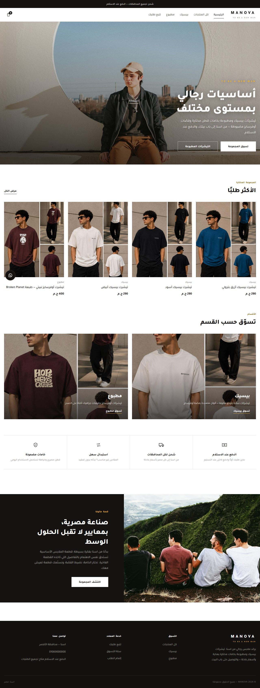
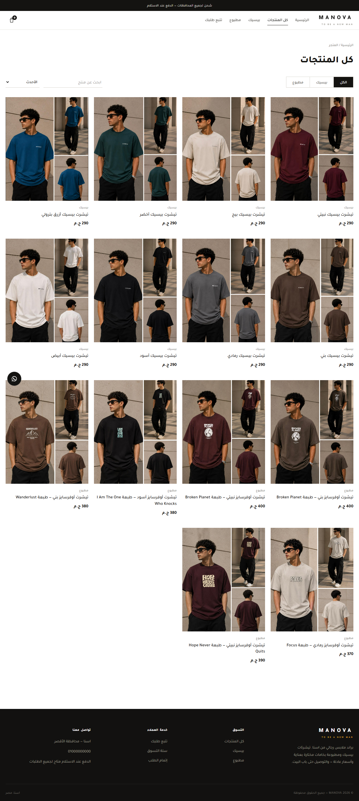
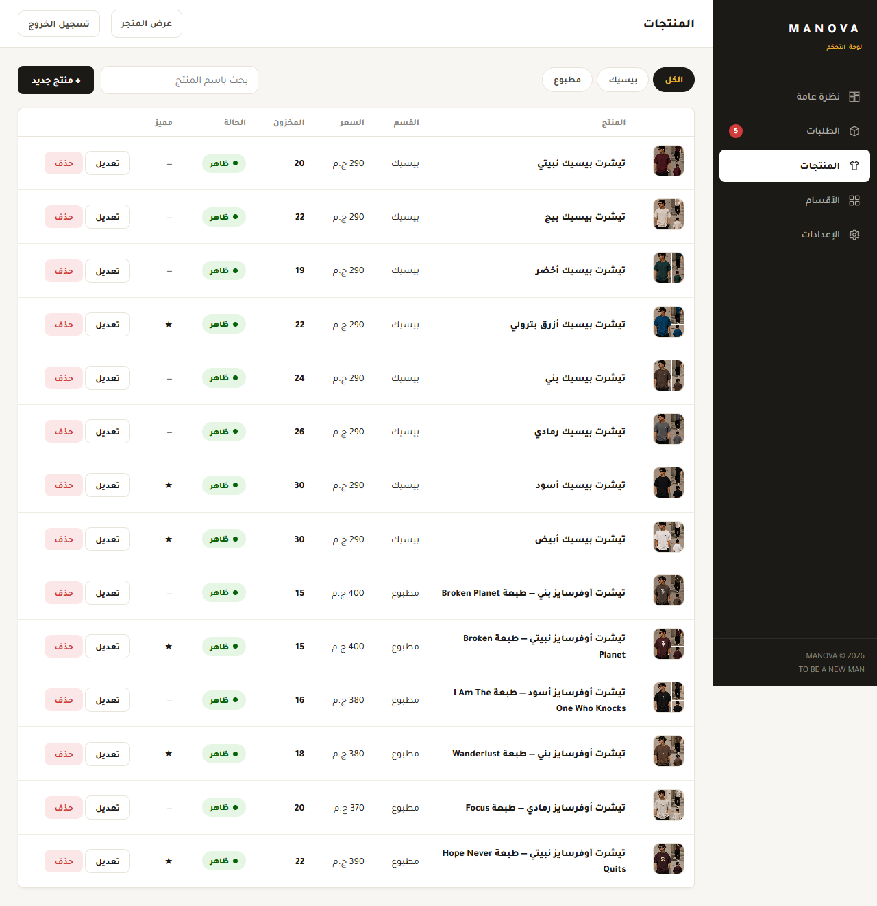

<div align="center">

# MANOVA — متجر مانوفا الإلكتروني 👕

**براند ملابس رجالي من اسنا — متجر إلكتروني كامل + لوحة تحكم، بالعربي وبالكامل RTL.**


</div>

---

متجر إلكتروني متكامل لبراند **مانوفا** — تيشرتات بيسيك ومطبوعة بخامات قطن مختارة، الدفع عند الاستلام، والتوصيل لكل المحافظات. الموقع **ثابت بالكامل (Static)** بيتكلم مباشرة مع **Firebase** — يعني بيستضاف **مجانًا 100%** على Cloudflare Pages من غير أي سيرفر ولا بطاقة ائتمان.

## ✨ المميزات

### 🛍️ المتجر (للعملاء)
- صفحة رئيسية بهوية البراند (ذهبي/أسود) مع أقسام ومنتجات مميزة.
- تصفّح المنتجات بالأقسام (بيسيك / مطبوع / وأي قسم تضيفه) مع **بحث وفرز**.
- صفحة منتج باختيار المقاس واللون والكمية ومعرض صور.
- سلة تسوق (تُحفظ في المتصفح) + إتمام الطلب بالدفع عند الاستلام أو المحفظة الإلكترونية.
- **تتبّع الطلب** برقم الطلب ورقم الموبايل.
- تصميم متجاوب بالكامل (موبايل/تابلت/كمبيوتر) وواجهة عربية RTL.

### 🎛️ لوحة التحكم (للإدارة)
- **نظرة عامة**: إحصائيات المبيعات، رسوم بيانية يومية، وأكثر المنتجات مبيعًا.
- **الطلبات**: عرض وبحث وتغيير حالة الطلب (جديد → مؤكد → شحن → توصيل)، مع خصم المخزون عند التأكيد وإرجاعه عند الإلغاء.
- **المنتجات**: إضافة/تعديل/حذف، رفع صور (بتتضغط تلقائيًا في المتصفح)، مقاسات وألوان، مخزون، وتمييز المنتج.
- **الأقسام**: نظام أقسام ديناميكي — أضِف «بناطيل» أو «كابات» أو «أحزمة» أو «جزم»… وتظهر تلقائيًا في المتجر.
- **الإعدادات**: محتوى الصفحة الرئيسية، بيانات التواصل، مناطق الشحن وأسعارها، وتغيير كلمة المرور.

## 🖼️ لقطات من الموقع

| الصفحة الرئيسية | المتجر | لوحة التحكم |
|:---:|:---:|:---:|
|  |  |  |

## 🛠️ كيف شغال من غير سيرفر؟

- **HTML/CSS/JS خام** — بدون أي framework، خفيف وسريع، RTL بالكامل.
- **Firestore** — قاعدة البيانات: المنتجات والأقسام والطلبات والإعدادات. المتصفح بيتكلم معاها مباشرة، والحماية كلها في **قواعد أمان** ([`firestore.rules`](firestore.rules)): القراءة عامة، والكتابة الإدارية للأدمن بس، وإنشاء الطلبات مسموح بشكل مضبوط.
- **Firebase Authentication** — تسجيل دخول لوحة التحكم بالإيميل وكلمة المرور.
- **صور المنتجات** — بتتضغط في المتصفح (WebP) وبترفع على **Firebase Storage**، والمنتج بيخزّن رابط التحميل المباشر.
- **Cloudflare Pages** — بيستضيف الملفات الثابتة مجانًا مع CDN عالمي.

## 🚀 النشر والتجهيز

**اتبع الدليل الكامل خطوة بخطوة في [`SETUP.md`](SETUP.md)** — ملخصه:

1. أنشئ مشروع Firebase مجاني وفعّل **Authentication** (إيميل/باسورد) و**Firestore**.
2. انسخ إعدادات المشروع في [`public/js/firebase-config.js`](public/js/firebase-config.js).
3. الصق قواعد الأمان من [`firestore.rules`](firestore.rules) في تبويب Rules.
4. أضف الـ UID بتاعك في مجموعة `admins`.
5. ارفع مجلد `public` على **Cloudflare Pages**.
6. افتح `/admin/setup` واضغط زرار التجهيز — هيستورد المنتجات والأقسام والإعدادات.

## 💻 المعاينة محليًا

**المتطلبات:** [Node.js](https://nodejs.org) نسخة 18 أو أحدث (للمعاينة بس — مفيش أي حزم بتتثبت).

```bash
npm run dev
```

| الرابط | الوصف |
|---|---|
| http://localhost:3000 | المتجر (اللي يشوفه العميل) |
| http://localhost:3000/admin | لوحة التحكم |

> على ويندوز تقدر كمان تعمل دبل كليك على ملف `تشغيل-المتجر.bat`.
> المعاينة بتتصل بقاعدة بيانات Firebase الحقيقية — لازم تكون خلصت خطوات الإعداد الأول.

## 🗂️ هيكل المشروع

```
manova/
├── public/                  # الموقع كله — ده اللي بيترفع على الاستضافة
│   ├── index.html · shop.html · product.html · cart.html
│   ├── checkout.html · track.html · success.html · 404.html
│   ├── css/store.css
│   ├── js/
│   │   ├── firebase-config.js   # إعدادات مشروعك (املأها من Firebase Console)
│   │   ├── firebase.js          # طبقة الاتصال بـ Firestore + معالجة الصور
│   │   └── store.js             # منطق واجهة المتجر
│   ├── images/products/         # صور المنتجات الأساسية
│   └── admin/                   # لوحة التحكم
│       ├── index.html · orders.html · products.html
│       ├── categories.html · settings.html · login.html
│       ├── setup.html           # صفحة تجهيز المتجر أول مرة
│       └── assets/              # admin.css · admin.js · charts.js · seed-data.js
├── firestore.rules          # قواعد أمان قاعدة البيانات
├── storage.rules            # قواعد أمان تخزين صور المنتجات
├── firebase.json            # إعداد النشر البديل على Firebase Hosting
├── scripts/dev-server.js    # خادم معاينة محلي بسيط
└── SETUP.md                 # دليل التجهيز والنشر خطوة بخطوة
```

## 🔐 الأمان

- كل صلاحيات الكتابة محكومة بقواعد Firestore — مفيش أي أسرار في كود الموقع (إعدادات `firebase-config.js` عامة بطبيعتها، والحماية في القواعد).
- الطلبات الجديدة بتتحقق شكليًا في القواعد، وأكواد الطلبات عشوائية غير قابلة للتخمين.
- المخزون بيتعدل بس من لوحة التحكم (عند تأكيد/إلغاء الطلب) — العميل ما يقدرش يلمسه.
- متجر دفع عند الاستلام: راجع تفاصيل الطلب مع العميل في مكالمة التأكيد قبل الشحن.

## 📄 الرخصة

كل الحقوق محفوظة لبراند **مانوفا** — انظر ملف [LICENSE](LICENSE).

<div align="center"><sub>MANOVA © 2026 — TO BE A NEW MAN — صُنع في اسنا 🇪🇬</sub></div>
